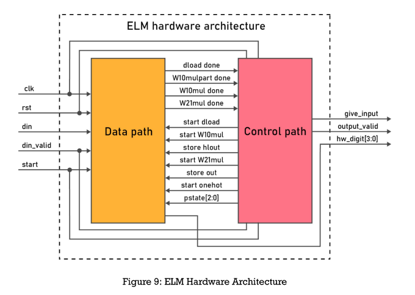
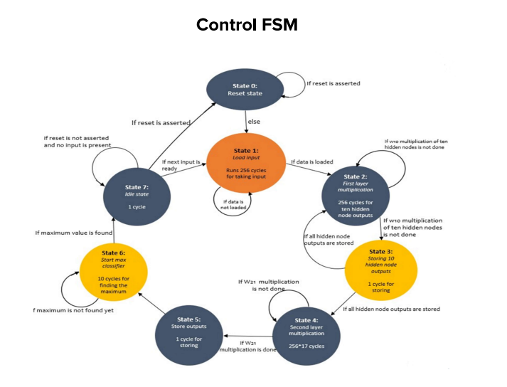

# Handwritten-digit-recognition-using-ELM

# Description of Extreme Learning Machine(ELM) Model

ELM(Extreme Learning Machine) is a machine learning algorithm that uses a single layered hidden node and can produce acceptable predictive performance and their computational cost is much lower than networks trained by the backpropagation algorithm

## Input nodes and weights
  Input handwritten digit image of size 16*16(256bits) is fed to the model and input weights(W10) are randomly generated using LFSR module.
  ## Hidden neuron value calculation
  Weighted multiplication of the 256x1 test input pattern and W10 weights generated is performed and these outputs are passed through ReLU activation function.
  ReLU: y = max(0,x)
  

  ReLU outputs are multiplied with the W21 matrix(generated after traning) and the digit corresponding to the maximum of ten output nodes is the final output(one hot encoded format)

  H = ReLU(X * W10) where H is hidden node activation value matrix, W10 is input weight(randomly initalized with size 256*420) and X is input node value matrix.

### Output node value calculation
  ReLU outputs are multiplied with the W21 matrix(generated after training) and the digit corresponding to the maximum of ten outputs nodes is the final output(one hot encoded format). This algorithm uses moore penrose matrix inversion method to determine output weights using hidden nodes activation value.
   
   W21 = Pinv(H) * Y

  

## Software Implementation
Tasks performed on MATLAB.
ELM algorithm uses only hidden layer. Number of hidden neurons is chosen based on maximum accuracy value. Multiple iterations are done in MATLAB by initalizing hidden neurons count from 10. Weights(W21 and W10) are converted to 16 bit fixed point representation for hardware implementation.

### Saving the weights(W10,W21) 
After fixing hidden nodes count to 420, multiple iterations are done and parameters at maximum accuracy obtained such as input node weights(W10), output node weights(W21) are saved.Weights obtained(decimal value) are to be converted to 16-bit fixed point representation. User defined function(dec2q) is used to convert floating point weights(W21, W10) to 16 bit fixed point representation for hardware implementation in MATLAB.

## Implementation 
Idea of randomly generating the input weights by LFSR to reduce the hardware for storing input weights. W10 matrix storage is eliminated by generating those weights using the hardware itself by particular seed values initalization and the biases are not used here in ELM implementation. W21 matrix is computed with respect to generated W10 weights(by LFSR) in MATLAB.
### LFSR implementation
16 bit LFSR output(A) is generated by using the feedback of XNOR of 4th, 13th, 15th and 16th bits to the LSB bit of a 16 bit shift register. 32767 is subtracted from each of these LFSR values(A) to get the mean centered weights(A-B). 5 bit arithmetic right shifts is performed on those mean centered weights to allocate 5 bits for the integer part. Shifted value is the final W10 weight generated using the LFSR algorithm.

## Hardware Architecture

## RTL View and Simulation

## Cell Layout 
### Serial adder layout

### LFSR layout

## Transistor Layout
### Serial adder layout

### LFSR layout

## STA Report
### Summary of setup slack 

### Maximum operable clock frequency
 

### Critical path summary

### Critical path in Chip planner

